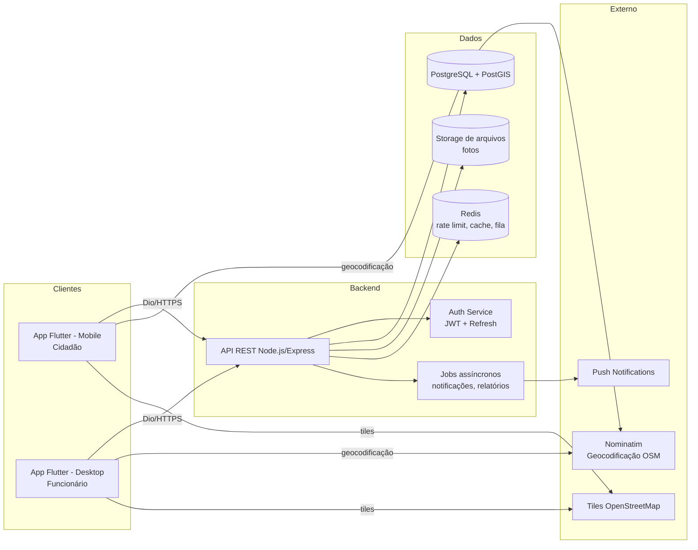
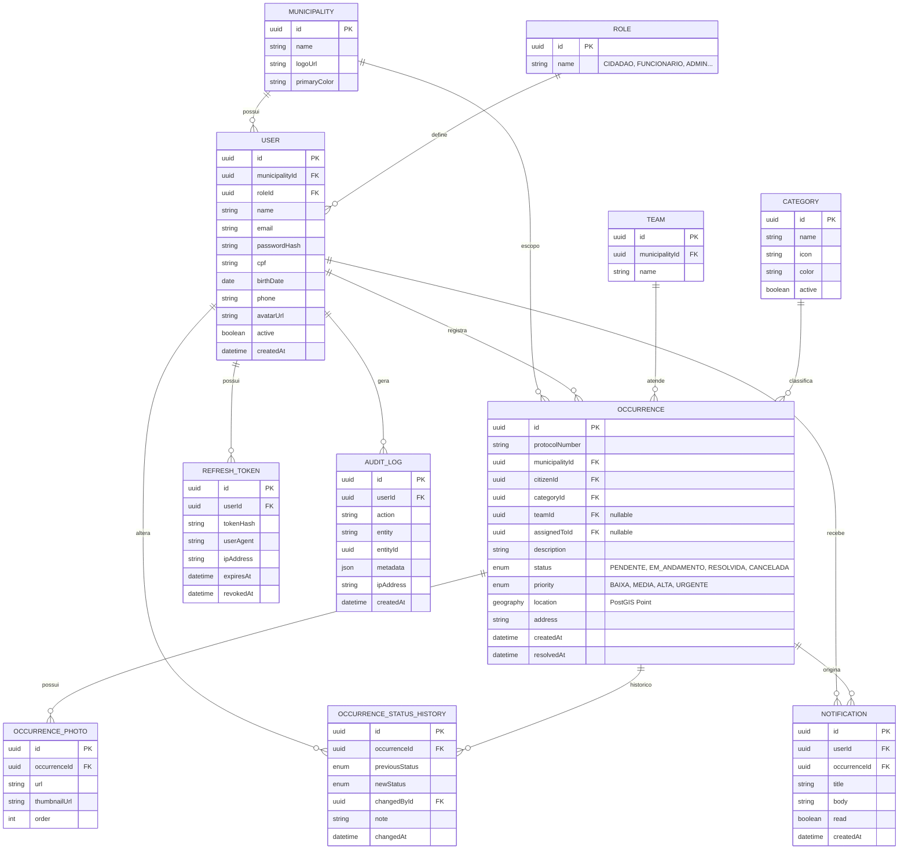
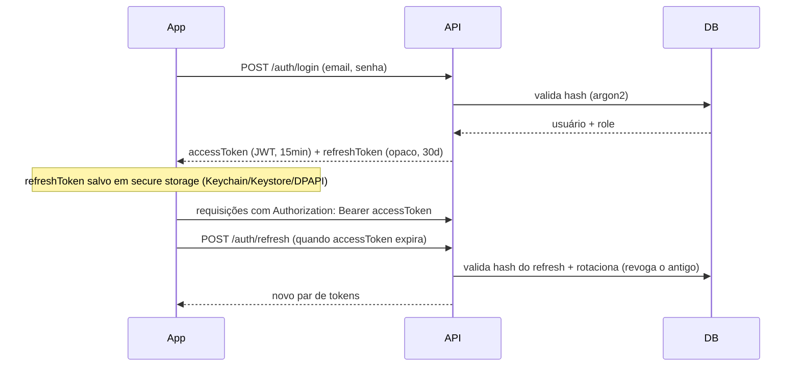
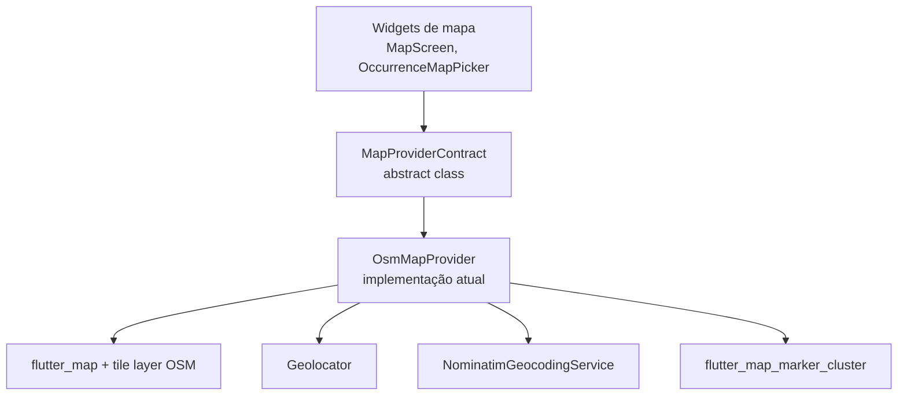
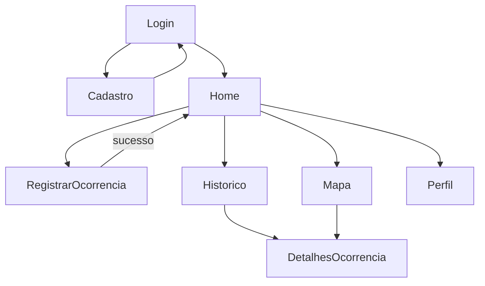
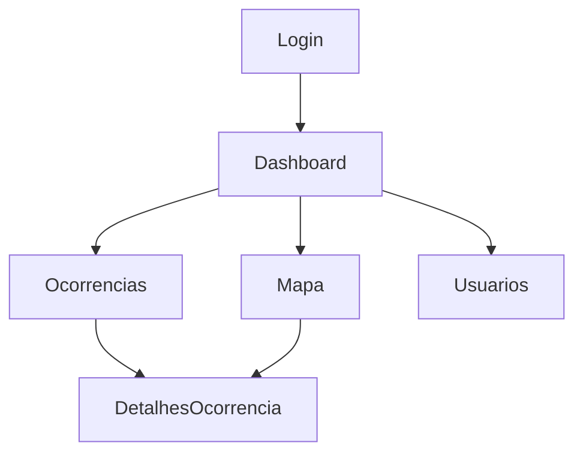

# GoodRoads — Arquitetura Completa (Etapa 0)

> Documento de arquitetura. Nenhum código de produto é escrito antes da aprovação deste documento, conforme solicitado. As imagens de referência recebidas foram classificadas como: **telas grandes = Desktop (funcionário)**, **telas pequenas/alongadas = Mobile (cidadão)**.

## 0. Estado atual do repositório

O diretório já contém um projeto Flutter recém-criado (`flutter create`) com targets `android`, `ios`, `windows`, `linux`, `macos`, `web` e apenas o boilerplate padrão (`lib/main.dart`, `test/widget_test.dart`). Não existe ainda backend. A arquitetura abaixo assume:

- **Um único app Flutter** (este repositório), que se comporta como app do cidadão em Android/iOS e como painel administrativo em Windows — em vez de dois apps separados. Justificativa na seção 7.1.
- **Um backend separado** (Node.js), a ser criado como projeto irmão (ex.: pasta `backend/` no mesmo repo, ou repositório próprio — decisão na seção 9).

---

## 1. Visão geral



**Padrão arquitetural:** Clean Architecture + modularização por *feature*, tanto no backend quanto no frontend, com inversão de dependência entre camadas (domínio não conhece infraestrutura). Isso é o que permite trocar provedor de mapa, storage ou até o banco sem reescrever regras de negócio.

---

## 2. Backend (Node.js + Express + Prisma + PostgreSQL)

### 2.1 Estrutura de pastas

```
backend/
├── prisma/
│   ├── schema.prisma
│   ├── migrations/
│   └── seed.ts
├── src/
│   ├── config/                 # env, constantes, cors, swagger
│   ├── modules/
│   │   ├── auth/                # login, refresh, forgot/reset password
│   │   │   ├── auth.controller.ts
│   │   │   ├── auth.service.ts
│   │   │   ├── auth.routes.ts
│   │   │   ├── auth.schema.ts   # validação (zod)
│   │   │   └── auth.repository.ts
│   │   ├── users/                # perfil, cidadãos
│   │   ├── staff/                # CRUD de funcionários (admin)
│   │   ├── occurrences/          # ocorrências + histórico de status
│   │   ├── categories/
│   │   ├── teams/                # times de atendimento
│   │   ├── notifications/
│   │   ├── dashboard/            # estatísticas agregadas
│   │   ├── reports/               # exportação CSV/PDF
│   │   └── map/                   # busca geoespacial (bbox/raio)
│   ├── core/
│   │   ├── middlewares/          # auth.guard, rbac.guard, error-handler, rate-limit, audit-logger
│   │   ├── errors/                # AppError, mapeamento HTTP
│   │   └── logger/                # pino/winston estruturado
│   ├── infra/
│   │   ├── database/prisma.client.ts
│   │   ├── storage/               # interface + implementação (local/S3)
│   │   ├── mail/
│   │   └── push/                  # interface + implementação FCM
│   ├── shared/                    # utils, paginação, tipos comuns
│   └── server.ts / app.ts
├── tests/
└── package.json
```

Cada módulo segue o mesmo padrão de 5 arquivos (`routes → controller → service → repository → schema`), o que mantém a navegação previsível conforme o número de módulos cresce — importante quando várias prefeituras/equipes forem contribuir.

### 2.2 Camadas e responsabilidades

- **routes**: apenas mapeia HTTP → controller.
- **controller**: parseia request/response, chama service, nunca contém regra de negócio.
- **service**: regra de negócio pura (ex.: "cidadão só pode ver as próprias ocorrências"; "mudança de status gera histórico + notificação").
- **repository**: única camada que fala com o Prisma. Se um dia trocarmos Prisma por outro ORM, só essa camada muda.
- **schema**: validação de entrada com **zod**, aplicada em middleware antes do controller (proteção contra payloads malformados e base da sanitização).

---

## 3. Banco de Dados

### 3.1 Modelo Entidade-Relacionamento



### 3.2 Decisões de modelagem (com justificativa)

| Decisão | Justificativa |
|---|---|
| `Municipality` como entidade desde o início | O briefing menciona "diversas prefeituras" e "milhares de usuários". Sem isolamento por prefeitura desde o modelo, migrar para multi-tenant depois exige reescrever quase todas as queries. Custo de adicionar agora é baixo (1 FK a mais); custo de adicionar depois é altíssimo. |
| `location` como `geography(Point)` do **PostGIS** em vez de `latitude`/`longitude` em float soltos | Permite consultas geoespaciais nativas e indexadas (`ST_DWithin`, bounding box) para "ocorrências próximas" e para o mapa do desktop, muito mais rápidas que calcular distância em memória. |
| `OccurrenceStatusHistory` como tabela própria, não só um campo `status` | O briefing exige "toda alteração de status deve gerar histórico". Guardar isso separado também vira a fonte de dados da timeline exibida na tela de detalhes. |
| `protocolNumber` gerado (ex.: `PB-2026-000123`) | Referência amigável para o cidadão acompanhar, sem expor o UUID interno. |
| `AuditLog` genérico (action/entity/entityId/metadata) em vez de logs por módulo | Um único mecanismo de auditoria serve para qualquer entidade nova que for adicionada no futuro, sem criar uma tabela de log por feature. |
| Senhas com **Argon2id** em vez de bcrypt | Recomendação atual da OWASP para hashing de senha; resistente a ataques com GPU/ASIC. |
| Enums de `status`/`priority` no banco (Postgres `ENUM` ou `check constraint` via Prisma) | Garante integridade no nível do banco, não só na aplicação — evita estados inválidos mesmo se outra aplicação escrever direto no banco no futuro. |

---

## 4. Autenticação, RBAC e Segurança

### 4.1 Fluxo de autenticação



- **Access token JWT**: payload mínimo (`sub`, `role`, `municipalityId`), vida curta (15 min), assinado com RS256 (permite rotação de chave e validação por múltiplos serviços no futuro sem compartilhar segredo simétrico).
- **Refresh token**: opaco (não-JWT), armazenado como hash no banco, com rotação a cada uso (refresh token reuse detection: se um token já revogado for reapresentado, todos os tokens da sessão são revogados — mitiga roubo de token).
- **RBAC**: tabela `Role` + verificação por middleware (`requireRole('FUNCIONARIO')`) no backend, **e também** guards de rota no frontend (Flutter) — o briefing exige checagem nos dois lados. Estrutura pensada para adicionar roles (`ADMIN_PREFEITURA`, `SUPERADMIN`) sem alterar código, apenas dados.

### 4.2 Checklist de segurança aplicado

- Validação de entrada com zod em 100% dos endpoints (contra payloads malformados/oversized).
- Prisma (query builder parametrizado) elimina SQL Injection por construção.
- Sanitização de HTML em campos de texto livre (descrição) antes de persistir — mitigação de XSS armazenado.
- Rate limiting (Redis + `express-rate-limit`) por IP e por usuário, mais agressivo em `/auth/*`.
- Helmet para headers HTTP seguros; CORS restrito a origens conhecidas.
- Upload de fotos: validação de mime-type real (magic bytes, não apenas extensão), limite de tamanho, reprocessamento/recompressão da imagem no servidor (evita upload de arquivo malicioso disfarçado de imagem).
- Logs de auditoria em toda ação sensível (mudança de status, exclusão, criação de funcionário).

---

## 5. API REST — Estrutura de Endpoints

| Método | Rota | Quem acessa | Descrição |
|---|---|---|---|
| POST | `/api/v1/auth/register` | Cidadão | Cadastro |
| POST | `/api/v1/auth/login` | Todos | Login |
| POST | `/api/v1/auth/refresh` | Todos | Renova access token |
| POST | `/api/v1/auth/logout` | Todos | Revoga refresh token |
| POST | `/api/v1/auth/forgot-password` | Todos | Envia e-mail de recuperação |
| POST | `/api/v1/auth/reset-password` | Todos | Redefine senha |
| GET/PATCH | `/api/v1/users/me` | Todos | Perfil próprio |
| POST | `/api/v1/users/me/avatar` | Todos | Upload de avatar |
| POST | `/api/v1/occurrences` | Cidadão | Registrar ocorrência (multipart: dados + fotos) |
| GET | `/api/v1/occurrences` | Cidadão (só as suas) / Funcionário (todas, com filtros/paginação) | Listagem |
| GET | `/api/v1/occurrences/:id` | Ambos (com regra de posse) | Detalhes |
| PATCH | `/api/v1/occurrences/:id/status` | Funcionário | Muda status → gera histórico + notificação |
| PATCH | `/api/v1/occurrences/:id` | Funcionário | Categoria, prioridade, equipe responsável |
| GET | `/api/v1/occurrences/:id/history` | Ambos | Timeline de status |
| GET | `/api/v1/map/occurrences` | Ambos | Busca geoespacial (bbox/raio), retorno leve para clustering |
| GET | `/api/v1/categories` · CRUD | Funcionário (escrita) / Todos (leitura) | Categorias |
| GET/POST | `/api/v1/teams` | Funcionário | Times de atendimento |
| GET/POST/PATCH | `/api/v1/staff` | Admin | Gestão de funcionários |
| GET | `/api/v1/dashboard/stats` | Funcionário | Cards + gráficos do dashboard |
| GET | `/api/v1/notifications` · PATCH `/:id/read` | Todos | Notificações |
| GET | `/api/v1/reports/export?format=csv\|pdf` | Funcionário | Exportação de relatórios |

Todas as rotas versionadas sob `/api/v1` para permitir evolução sem quebrar clientes antigos (importante quando houver apps já instalados em produção).

---

## 6. Arquitetura de Mapas (desacoplada do provedor)

Requisito: usar exclusivamente OpenStreetMap, mas manter a possibilidade de trocar de provedor sem reescrever telas.



`MapProviderContract` expõe métodos como `getTileLayer()`, `currentPosition()`, `geocode(query)`, `reverseGeocode(latLng)`, `watchPosition()`. As telas dependem só dessa interface (injetada via Riverpod). Trocar tiles/geocodificador no futuro = criar uma nova implementação e trocar o provider — zero mudança nas telas. Essa camada mora no *core* compartilhado do app (seção 7).

**Mobile:** localização atual centralizada automaticamente, marcadores diferenciados por status/cor, seleção/ajuste manual do marcador antes de enviar ocorrência.
**Desktop:** todas as ocorrências no mapa com *clustering*, busca por endereço (Nominatim), filtros por status/categoria/período aplicados diretamente às queries do backend (`/map/occurrences`), abertura rápida do painel de detalhes ao clicar num marcador.

---

## 7. Frontend Flutter (Mobile + Desktop no mesmo app)

### 7.1 Uma base de código, dois "shells" — justificativa

**Alternativas avaliadas:**

1. **Dois apps Flutter separados** (monorepo com Melos, pacote `core` compartilhado + `app_mobile` + `app_desktop`).
2. **Um único app** (o que já existe neste repositório) que detecta a plataforma no bootstrap e carrega um *shell* de UI diferente — recomendado.

| Critério | Um app (recomendado) | Dois apps |
|---|---|---|
| Alinhamento com o briefing | "o próprio aplicativo deverá possuir interface específica para cada plataforma" — texto sugere um único produto | Exigiria reinterpretar o requisito |
| Distribuição real | Cidadão instala via Play Store/App Store; funcionário instala o `.exe`/MSIX no Windows — nunca convivem no mesmo binário rodando | Igual |
| Compartilhamento de código (entities, DTOs, auth, rede, tema) | Direto, mesmo projeto | Precisa de pacote local + gestão de versões (Melos) |
| Risco de código administrativo vazar para o APK do cidadão | Mitigado com *tree-shaking* por `kIsWeb`/`Platform` + separação em camadas (feature `staff/` nunca importada pelo shell mobile) | Nulo, pois são binários diferentes desde a raiz |
| Complexidade de build/CI | Menor (1 pipeline com múltiplos targets) | Maior (N pipelines) |

**Decisão:** manter um único app, mas com **modularização estrita por perfil dentro do próprio código** (`features/citizen/*` e `features/staff/*` nunca se importam mutuamente), de forma que, se no futuro a equipe decidir separar em dois binários, a migração seja apenas mover pastas — não reescrever. Registro isso como melhoria arquitetural: a fronteira entre os dois "apps" já nasce desenhada mesmo estando no mesmo repositório.

O `main.dart` decide o *shell* raiz:

```dart
Widget resolveRootShell() {
  if (kIsWeb) return const UnsupportedPlatformScreen(); // fora de escopo
  if (Platform.isWindows) return const StaffApp();       // funcionário
  return const CitizenApp();                              // Android/iOS
}
```

### 7.2 Estrutura de pastas

```
lib/
├── main.dart                      # bootstrap + seleção de shell por plataforma
├── app/
│   ├── citizen_app.dart           # MaterialApp do cidadão (tema, rotas)
│   └── staff_app.dart             # MaterialApp do funcionário (tema, rotas)
├── core/
│   ├── theme/                     # design tokens, ColorScheme M3 claro/escuro
│   ├── network/                   # DioClient, interceptors (auth, retry, logging)
│   ├── storage/                   # secure storage (tokens), cache local (Drift)
│   ├── routing/                   # go_router por app (citizen_router, staff_router)
│   ├── map/                       # MapProviderContract + OsmMapProvider (seção 6)
│   ├── error/                     # Failure/Result (fpdart Either), tratamento global
│   ├── widgets/                   # componentes compartilhados (empty state, skeleton...)
│   └── di/                        # providers Riverpod globais (dio, storage, session)
├── features/
│   ├── auth/
│   │   ├── domain/                # entities, usecases, repository (abstract)
│   │   ├── data/                  # models (fromJson), datasources, repository impl
│   │   └── presentation/          # pages, controllers (Riverpod), widgets
│   ├── citizen/
│   │   ├── home/
│   │   ├── occurrence_register/   # fluxo de 4 passos (localização/descrição/foto/envio)
│   │   ├── occurrence_history/
│   │   ├── occurrence_details/
│   │   ├── map/
│   │   └── profile/
│   └── staff/
│       ├── dashboard/
│       ├── occurrences_list/
│       ├── occurrence_details/
│       ├── map/
│       └── staff_management/       # cadastro/gestão de funcionários
└── l10n/                            # strings (pt-BR desde já, i18n-ready)
```

Mesma lógica de Clean Architecture do backend: `presentation` depende de `domain`, `domain` não depende de nada externo, `data` implementa as interfaces de `domain`. Isso é o que permite, por exemplo, testar as regras de negócio de "registrar ocorrência" sem subir Dio nem banco.

### 7.3 Gerência de estado: Riverpod

Avaliado contra Bloc e Provider puro:

- **Riverpod** (recomendado): DI + estado no mesmo mecanismo, testável sem `BuildContext`, suporta `AsyncNotifier` para estados assíncronos (loading/error/data) de forma nativa — encaixa bem com Clean Architecture (repositories injetados via `Provider`). Code-gen opcional (`riverpod_generator`) reduz boilerplate mantendo segurança de tipos.
- **Bloc**: mais verboso para casos simples (CRUD de tela), melhor para máquinas de estado muito complexas — não é o caso da maior parte das telas aqui.
- **Provider puro**: mais simples, mas fraco para composição de estados assíncronos e testes; tende a crescer mal em apps com muitos fluxos (como o de registro de ocorrência em 4 etapas).

### 7.4 Navegação — Mobile (Cidadão), 8 telas



1. Login · 2. Cadastro · 3. Home · 4. Registrar Ocorrência (wizard de 4 passos: Localização → Descrição → Foto → Enviar, contido em **uma** tela) · 5. Mapa · 6. Histórico · 7. Detalhes da Ocorrência · 8. Perfil.
*Recuperar senha* é um *bottom sheet*/tela modal a partir do Login — não conta como tela principal, conforme regra do briefing.

### 7.5 Navegação — Desktop (Funcionário), 6 telas



1. Login · 2. Dashboard · 3. Ocorrências (lista com filtros/busca/ordenação) · 4. Detalhes da Ocorrência (status, prioridade, observações, fotos, localização, histórico) · 5. Mapa · 6. Usuários/Cadastro de Funcionários (esta tela cobre o requisito explícito de "cadastro de funcionários como uma das telas principais"; categorias e configurações do sistema vivem como *dialogs*/painéis dentro das telas existentes, não como telas novas).

### 7.6 Offline, sincronização e performance (mobile)

- **Cache local:** Drift (SQLite reativo) guardando ocorrências do usuário e fila de envio pendente.
- **Fluxo offline-first para registro de ocorrência:** a ocorrência é salva localmente com status `PENDING_SYNC` imediatamente após o envio (mesmo sem internet); um *worker* em background tenta sincronizar quando a conectividade retorna (`connectivity_plus` + retry com backoff).
- **Compressão de imagem no device** (`flutter_image_compress`) antes do upload — reduz consumo de dados em zona rural, onde a conectividade é tipicamente pior (relevante para o público-alvo do app).
- **Skeleton loading / Empty states** como componentes reutilizáveis em `core/widgets`, não reimplementados por tela.

---

## 8. Casos de Uso (resumo)

**Cidadão:** cadastrar-se; entrar; recuperar senha; editar perfil; registrar ocorrência (com foto obrigatória e localização automática/ajustável); acompanhar histórico; ver detalhes e timeline de status; receber notificação push em toda mudança de status.

**Funcionário:** entrar; ver dashboard (totais, distribuição por status, série mensal); listar/pesquisar/filtrar/ordenar ocorrências; abrir detalhes; alterar status (gera histórico + notifica cidadão); definir prioridade/categoria/equipe; adicionar observações internas; ver fotos e localização exata no mapa; cadastrar/gerenciar funcionários; exportar relatórios (CSV/PDF).

**Admin (papel futuro, já suportado pelo modelo):** tudo do funcionário + configurações da prefeitura (categorias, times, branding) + gestão de outros admins.

---

## 9. Decisões em aberto — preciso da sua confirmação

1. **Backend no mesmo repositório** (ex.: pasta `backend/` ao lado do Flutter) **ou repositório GitHub separado?** Afeta CI/CD e a pasta que vou usar no próximo passo.
2. **Storage de fotos:** começar com armazenamento local em disco (mais simples para MVP) ou já integrar com um provedor S3-compatible (ex.: Cloudflare R2/MinIO) — recomendo já abstrair via interface `StorageProvider` independentemente da escolha, para trocar depois sem dor.
3. **Notificação push mobile:** Firebase Cloud Messaging é o padrão de mercado para Flutter e **não é uma API do Google Maps**, portanto não conflita com a restrição de mapas — confirma que posso usá-lo, ou prefere outro serviço (ex.: OneSignal)?

---

## 10. Próximos passos (por etapas, sem pular)

1. **Etapa 1 – Backend base:** setup do projeto Node/Express/Prisma, schema do banco completo, autenticação (registro/login/refresh) com testes.
2. **Etapa 2 – Módulo de ocorrências (API):** CRUD + upload de fotos + histórico de status + busca geoespacial.
3. **Etapa 3 – App Mobile (cidadão):** shell, tema M3, auth, as 8 telas.
4. **Etapa 4 – App Desktop (funcionário):** shell, as 6 telas, integração com dashboard/relatórios.
5. **Etapa 5 – Notificações push + sincronização offline.**
6. **Etapa 6 – Hardening de segurança, testes end-to-end, preparação para produção (Docker, CI/CD, observabilidade).**

Cada etapa será aberta com objetivo/justificativa e fechada com resumo do que foi feito, pendências e melhorias propostas, como pedido.

---

## 11. Melhorias propostas além do briefing original

- **Multi-tenancy (`Municipality`)** desde o modelo de dados — ver 3.2.
- **PostGIS** para geolocalização em vez de floats soltos — consultas de "ocorrências próximas" e clustering muito mais rápidas em escala.
- **Argon2id** em vez de bcrypt para hashing de senha.
- **Refresh token rotation com detecção de reuso** — mitigação extra contra roubo de sessão.
- **Fronteira `citizen/` vs `staff/` já isolada no código**, mesmo em um único app, preparando para eventual split em dois binários sem retrabalho.
- **Versionamento de API (`/api/v1`)** desde o primeiro endpoint.
