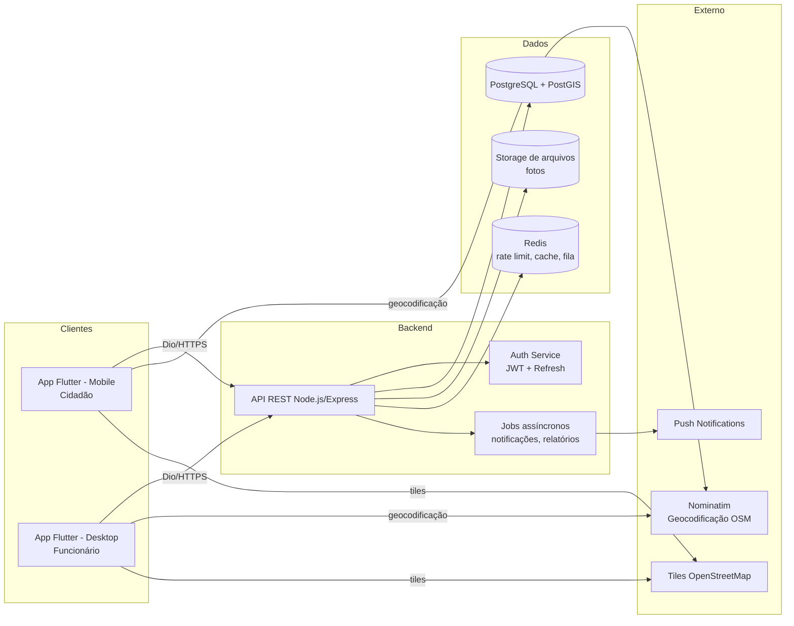
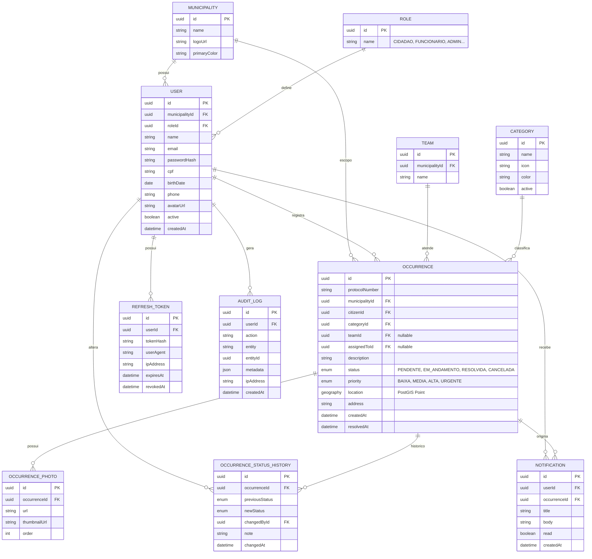
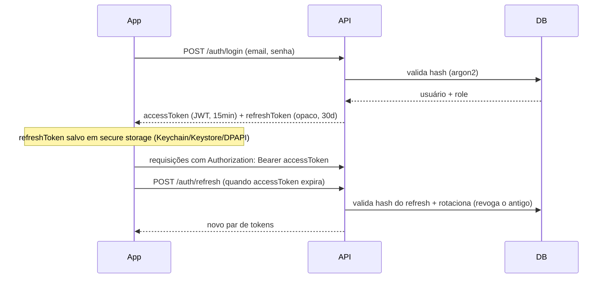
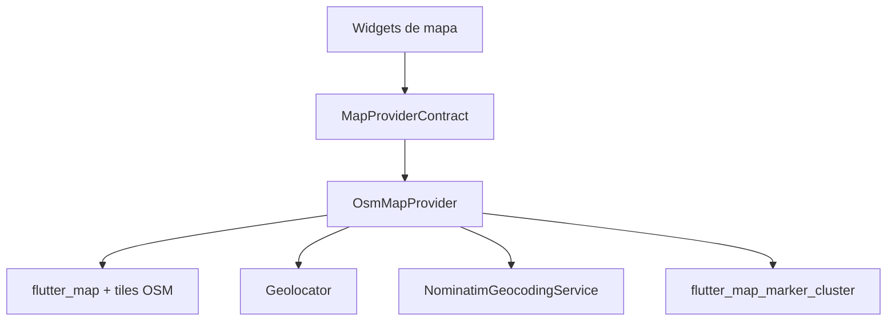
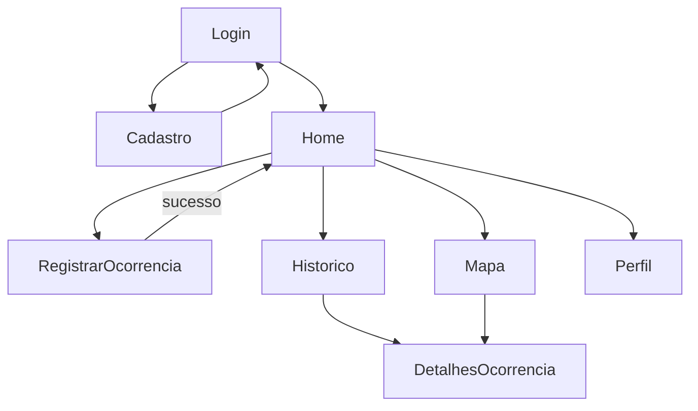
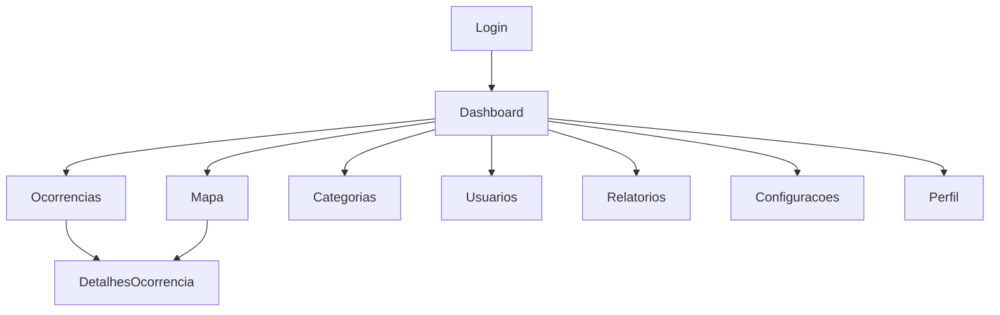

# GoodRoads — Arquitetura Completa (Etapa 0)

> Documento de arquitetura. Nenhum código de produto é escrito antes da aprovação deste documento, conforme solicitado. As imagens de referência recebidas foram classificadas como: **telas grandes = Desktop (funcionário)**, **telas pequenas/alongadas = Mobile (cidadão)**.
>
> **Atualização (Etapa 1):** por decisão do cliente, o projeto passou a ser um **monorepo** com as pastas `mobile/`, `desktop/`, `backend/` e `docs/`, em vez de um único app Flutter multiplataforma. A seção 7.1 abaixo (que recomendava um único app) foi substituída por essa decisão — ver `docs/DECISOES.md`.

## 0. Estado atual do repositório

Monorepo com 4 pastas: `mobile/` (app Flutter do cidadão — Android/iOS), `desktop/` (app Flutter do funcionário — Windows), `backend/` (API Node.js) e `docs/` (este documento e decisões). A arquitetura abaixo descreve o desenho completo; o estado de implementação de cada pasta é acompanhado em `docs/DECISOES.md`.

---

## 1. Visão geral



**Padrão arquitetural:** Clean Architecture + modularização por *feature*, tanto no backend quanto no frontend, com inversão de dependência entre camadas (domínio não conhece infraestrutura). Isso é o que permite trocar provedor de mapa, storage ou até o banco sem reescrever regras de negócio.

---

## 2. Backend (Node.js + Express + Prisma + PostgreSQL)

### 2.1 Estrutura de pastas

```
backend/
├── prisma/
│   ├── schema.prisma
│   ├── migrations/
│   └── seed.ts
├── src/
│   ├── config/                 # env, constantes, cors, swagger
│   ├── modules/
│   │   ├── auth/                # login, refresh, forgot/reset password
│   │   ├── users/                # perfil, cidadãos
│   │   ├── staff/                # CRUD de funcionários (admin)
│   │   ├── occurrences/          # ocorrências + histórico de status
│   │   ├── categories/
│   │   ├── teams/                # times de atendimento
│   │   ├── notifications/
│   │   ├── dashboard/            # estatísticas agregadas
│   │   ├── reports/               # exportação CSV/PDF
│   │   └── map/                   # busca geoespacial (bbox/raio)
│   ├── core/                      # middlewares, errors, logger
│   ├── infra/                     # prisma client, storage, mail, push
│   ├── shared/                    # utils, paginação, tipos comuns
│   └── server.ts / app.ts
├── tests/
└── package.json
```

Cada módulo segue o padrão `routes → controller → service → repository → schema`, o que mantém a navegação previsível conforme o número de módulos cresce.

### 2.2 Camadas e responsabilidades

- **routes**: apenas mapeia HTTP → controller.
- **controller**: parseia request/response, chama service, nunca contém regra de negócio.
- **service**: regra de negócio pura.
- **repository**: única camada que fala com o Prisma.
- **schema**: validação de entrada com **zod**, aplicada em middleware antes do controller.

### 2.3 Storage de arquivos (fotos) — abstração para trocar de provedor

```mermaid
graph TD
    SVC[OccurrenceService] --> IFACE[StorageProvider\ninterface]
    IFACE --> LOCAL[LocalDiskStorageProvider\n(dev, atual)]
    IFACE --> S3IMPL[S3StorageProvider\n(futuro: AWS S3 / R2 / MinIO)]
```

A interface `StorageProvider` expõe `upload(file): Promise<{url, key}>`, `delete(key)`, `getSignedUrl(key)`. Em desenvolvimento, `LocalDiskStorageProvider` grava em `backend/uploads/` e serve via rota estática. Trocar para S3-compatível no futuro é implementar `S3StorageProvider` (usando o SDK `@aws-sdk/client-s3`, compatível com R2/MinIO por apontar o `endpoint`) e trocar 1 binding no container de DI — nenhuma mudança nos módulos que consomem storage.

### 2.4 Notificações push — abstração de provedor

```mermaid
graph TD
    SVC[NotificationService] --> IFACE[PushProvider\ninterface]
    IFACE --> FCMIMPL[FcmPushProvider\n(atual)]
```

Interface `PushProvider.send(userId, title, body, data)`. A implementação atual usa Firebase Admin SDK (FCM) apenas dentro de `infra/push/fcm.provider.ts`; o restante do backend depende só da interface, permitindo trocar por outro provedor futuramente sem tocar nos módulos de negócio.

---

## 3. Banco de Dados

### 3.1 Modelo Entidade-Relacionamento



### 3.2 Decisões de modelagem (com justificativa)

| Decisão | Justificativa |
|---|---|
| `Municipality` como entidade desde o início | Suporte nativo a múltiplas prefeituras sem reescrever queries depois. |
| `location` como `geography(Point)` do **PostGIS** | Consultas geoespaciais nativas e indexadas para "ocorrências próximas" e clustering no mapa. |
| `OccurrenceStatusHistory` como tabela própria | Toda alteração de status gera histórico; também alimenta a timeline da tela de detalhes. |
| `protocolNumber` gerado (ex.: `PB-2026-000123`) | Referência amigável para o cidadão, sem expor o UUID interno. |
| `AuditLog` genérico | Um único mecanismo de auditoria serve qualquer entidade futura. |
| Senhas com **Argon2id** | Recomendação atual da OWASP para hashing de senha. |
| Enums de `status`/`priority` no banco | Integridade garantida no nível do banco. |

---

## 4. Autenticação, RBAC e Segurança

### 4.1 Fluxo de autenticação



- **Access token JWT**: payload mínimo (`sub`, `role`, `municipalityId`), vida curta (15 min), assinado com RS256.
- **Refresh token**: opaco, armazenado como hash no banco, com rotação a cada uso e detecção de reuso (revoga toda a sessão se um token já usado for reapresentado).
- **RBAC**: tabela `Role` + middleware (`requireRole`) no backend, e guards de rota no frontend.

### 4.2 Checklist de segurança aplicado

- Validação de entrada com zod em 100% dos endpoints.
- Prisma elimina SQL Injection por construção.
- Sanitização de campos de texto livre antes de persistir (mitigação de XSS armazenado).
- Rate limiting por IP e por usuário, mais agressivo em `/auth/*`.
- Helmet + CORS restrito.
- Upload de fotos: validação de mime-type real, limite de tamanho, recompressão no servidor.
- Logs de auditoria em toda ação sensível.

---

## 5. API REST — Estrutura de Endpoints

| Método | Rota | Quem acessa | Descrição |
|---|---|---|---|
| POST | `/api/v1/auth/register` | Cidadão | Cadastro |
| POST | `/api/v1/auth/login` | Todos | Login |
| POST | `/api/v1/auth/refresh` | Todos | Renova access token |
| POST | `/api/v1/auth/logout` | Todos | Revoga refresh token |
| POST | `/api/v1/auth/forgot-password` | Todos | Envia e-mail de recuperação |
| POST | `/api/v1/auth/reset-password` | Todos | Redefine senha |
| GET/PATCH | `/api/v1/users/me` | Todos | Perfil próprio |
| POST | `/api/v1/users/me/avatar` | Todos | Upload de avatar |
| POST | `/api/v1/occurrences` | Cidadão | Registrar ocorrência |
| GET | `/api/v1/occurrences` | Cidadão (só as suas) / Funcionário (todas) | Listagem |
| GET | `/api/v1/occurrences/:id` | Ambos (com regra de posse) | Detalhes |
| PATCH | `/api/v1/occurrences/:id/status` | Funcionário | Muda status → histórico + notificação |
| PATCH | `/api/v1/occurrences/:id` | Funcionário | Categoria, prioridade, equipe |
| GET | `/api/v1/occurrences/:id/history` | Ambos | Timeline de status |
| GET | `/api/v1/map/occurrences` | Ambos | Busca geoespacial (bbox/raio) |
| GET/POST/PATCH | `/api/v1/categories` | Funcionário (escrita) / Todos (leitura) | Categorias |
| GET/POST | `/api/v1/teams` | Funcionário | Times de atendimento |
| GET | `/api/v1/staff` | Funcionário/Admin | Lista de funcionários (para atribuir ocorrências) |
| POST/PATCH | `/api/v1/staff` | Admin | Criar/editar funcionários |
| GET | `/api/v1/dashboard/stats` | Funcionário | Cards + gráficos |
| GET/PATCH | `/api/v1/notifications` | Todos | Notificações |
| POST/DELETE | `/api/v1/notifications/devices` | Todos | Registro/remoção de device token (FCM, Etapa 5) |
| GET | `/api/v1/reports/export?format=csv\|pdf` | Funcionário | Exportação de relatórios (CSV ou PDF) |

Todas as rotas versionadas sob `/api/v1`.

---

## 6. Arquitetura de Mapas (desacoplada do provedor)



**Mobile:** localização atual, marcadores por status, ajuste manual antes do envio.
**Desktop:** clustering, busca por endereço, filtros aplicados ao backend, painel rápido de detalhes.

---

## 7. Frontend Flutter — Monorepo com apps separados

### 7.1 Decisão final: `mobile/` e `desktop/` como projetos Flutter independentes

Por decisão do cliente, o projeto usa **dois apps Flutter fisicamente separados** dentro do monorepo, em vez de um único app com shell condicional (alternativa que havia sido recomendada na v1 deste documento). Cada pasta é um projeto Flutter completo e independente, com seu próprio `pubspec.yaml`.

**Compartilhamento de código entre os dois apps:** como não há um pacote Dart compartilhado nesta etapa (decisão do cliente foi manter as pastas simples, sem um `packages/core` via Melos), o código comum (modelos de API, cliente Dio, tema base, camada de mapas) será duplicado de forma controlada nas duas apps, isolado em `core/` dentro de cada uma. Ambas seguem exatamente a mesma organização interna (`core/` + `features/`), então portar uma melhoria de uma pasta para a outra é mecânico. Se a duplicação se tornar custosa, a evolução natural é extrair um pacote Dart local (`packages/goodroads_core`) consumido via `path:` — mudança de baixo risco, não estrutural.

### 7.2 Estrutura de pastas (mesma organização em `mobile/` e `desktop/`)

```
mobile/  (ou desktop/)
├── lib/
│   ├── main.dart
│   ├── app.dart                   # MaterialApp, tema, rotas
│   ├── core/
│   │   ├── theme/                 # design tokens M3 claro/escuro
│   │   ├── network/                # DioClient, interceptors
│   │   ├── storage/                 # secure storage, cache local
│   │   ├── routing/                 # go_router
│   │   ├── map/                     # MapProviderContract + OsmMapProvider
│   │   ├── error/                   # Failure/Result
│   │   ├── widgets/                 # empty state, skeleton, etc.
│   │   └── di/                      # providers Riverpod globais
│   └── features/
│       ├── auth/{domain,data,presentation}
│       └── ... (telas específicas de cada app — ver 7.4/7.5)
└── test/
```

Mesma lógica de Clean Architecture do backend: `presentation` depende de `domain`, `domain` não depende de nada externo, `data` implementa as interfaces de `domain`.

### 7.3 Gerência de estado: Riverpod

- **Riverpod** (recomendado): DI + estado no mesmo mecanismo, testável sem `BuildContext`, `AsyncNotifier` para estados assíncronos.
- **Bloc**: mais verboso para CRUDs simples; melhor só em máquinas de estado muito complexas.
- **Provider puro**: fraco para composição assíncrona e testes.

### 7.4 Navegação — `mobile/` (Cidadão), 8 telas



1. Login · 2. Cadastro · 3. Home · 4. Registrar Ocorrência (wizard de 4 passos em 1 tela) · 5. Mapa · 6. Histórico · 7. Detalhes da Ocorrência · 8. Perfil.
*Recuperar senha* é modal a partir do Login — não conta como tela principal.

### 7.5 Navegação — `desktop/` (Funcionário), 10 telas

> **Atualização (Etapa 4):** por decisão explícita do cliente, o limite original de "exatamente 6 telas" do briefing foi substituído por um escopo maior: Categorias, Relatórios, Configurações e Perfil próprio passam de dialogs/painéis (como estava desenhado na v1 deste documento) para telas de navegação principal, cada uma com sua própria entrada fixa na barra lateral. Ver `docs/DECISOES.md`, entrada "Etapa 4".



1. Login · 2. Dashboard (cards de indicadores + gráficos + ocorrências recentes) · 3. Ocorrências (lista com busca/filtros/ordenação/paginação) · 4. Detalhes da Ocorrência (fotos, mapa, atribuição, mudança de status, notas internas, timeline) · 5. Mapa (clustering + filtros) · 6. Categorias (CRUD) · 7. Usuários (gestão de funcionários — visível a todo `FUNCIONARIO`/`ADMIN`; criar/editar restrito a `ADMIN`) · 8. Relatórios (exportação de ocorrências filtradas em CSV) · 9. Configurações (tema claro/escuro, notificações locais, dados da prefeitura) · 10. Perfil (dados da própria conta, troca de senha, logout).

*Barra lateral fixa* substitui a barra inferior do mobile — cabe mais itens de navegação sem exigir um menu "mais", coerente com o layout das telas de referência recebidas do cliente. Ações de edição pontuais (ex.: mudar status de uma ocorrência, editar uma categoria) continuam usando dialogs/bottom sheets dentro da tela, não telas novas.

### 7.6 Offline, sincronização e performance (`mobile/`)

> **Atualização (Etapa 5):** implementado. Cache local com `sqflite` (SQL cru) em vez de Drift — Drift exige codegen (`build_runner`), que este ambiente de desenvolvimento não tem como rodar/validar (mesma razão pela qual o Riverpod do projeto já evita codegen). Ver `docs/DECISOES.md`.

- **Cache local:** `sqflite`, uma tabela (`pending_occurrences`) em `core/offline/offline_database.dart`.
- **Offline-first:** se `POST /occurrences` falhar por `NetworkFailure`, a ocorrência (incluindo fotos, copiadas para um diretório persistente) é salva localmente e sincronizada automaticamente quando a conectividade volta (`connectivity_plus`), com até 5 tentativas por item. Também pode ser disparada manualmente pelo banner da Home.
- **Push:** Firebase Cloud Messaging real (`core/push/`), registro de device token no login/logout, notificação em foreground via `flutter_local_notifications`.
- **Compressão de imagem no device** antes do upload.
- **Skeleton loading / Empty states** reutilizáveis em `core/widgets`.

---

## 8. Casos de Uso (resumo)

**Cidadão:** cadastrar-se; entrar; recuperar senha; editar perfil; registrar ocorrência; acompanhar histórico; ver detalhes e timeline; receber push em toda mudança de status.

**Funcionário:** entrar; dashboard; listar/pesquisar/filtrar/ordenar ocorrências; alterar status/prioridade/categoria/equipe; observações internas; ver fotos e localização; cadastrar/gerenciar funcionários; exportar relatórios.

**Admin (papel futuro, já suportado pelo modelo):** tudo do funcionário + configurações da prefeitura + gestão de admins.

---

## 9. Decisões confirmadas pelo cliente (ver `docs/DECISOES.md`)

1. Monorepo com `mobile/`, `desktop/`, `backend/`, `docs/`.
2. Storage local em desenvolvimento, abstraído via `StorageProvider` para migrar a S3/R2/MinIO sem mudanças estruturais.
3. Firebase Cloud Messaging para push, isolado atrás de `PushProvider`.

---

## 10. Próximos passos (por etapas, sem pular)

1. **Etapa 1 – Backend base** *(em andamento)*: monorepo, setup Node/Express/Prisma, schema completo, autenticação (registro/login/refresh/forgot-reset) com testes.
2. **Etapa 2 – Módulo de ocorrências (API):** CRUD + upload de fotos + histórico de status + busca geoespacial.
3. **Etapa 3 – App Mobile (cidadão):** as 8 telas.
4. **Etapa 4 – App Desktop (funcionário):** as 10 telas *(concluída — escopo expandido a pedido do cliente, ver seção 7.5 e docs/DECISOES.md)*.
5. **Etapa 5 – Notificações push + sincronização offline** *(concluída, ver docs/DECISOES.md)*.
6. **Etapa 6 – Hardening de segurança, testes end-to-end, produção (Docker, CI/CD, observabilidade)** *(concluída, ver docs/DECISOES.md — última etapa do roadmap original)*.

---

## 11. Melhorias propostas além do briefing original

- **Multi-tenancy (`Municipality`)** desde o modelo de dados.
- **PostGIS** para geolocalização em vez de floats soltos.
- **Argon2id** em vez de bcrypt.
- **Refresh token rotation com detecção de reuso.**
- **`StorageProvider` e `PushProvider` como interfaces** desde o dia 1 (decisões do cliente já seguem esse padrão).
- **Versionamento de API (`/api/v1`)** desde o primeiro endpoint.

---

## 12. Produção e observabilidade (Etapa 6)

- **Saúde do processo:** `GET /health` (liveness — sempre 200 se o processo está de pé) e `GET /health/ready` (readiness — só 200 se o Postgres responder), usados por orquestradores (Docker `HEALTHCHECK`, Kubernetes probes) para decidir reinício/roteamento de tráfego.
- **Métricas:** `GET /metrics` no formato Prometheus (`prom-client`), com métricas padrão do processo Node e um histograma/contador de duração de requisições HTTP por rota/método/status (`src/core/observability/metrics.ts`). Sem autenticação própria — deve ficar atrás de rede interna/VPC em produção, não exposta junto com a API pública.
- **Correlação de logs:** cada requisição recebe um `X-Request-Id` (propagado se o cliente enviar, gerado se não) ecoado na resposta e anexado a cada linha de log daquela requisição via `pino-http`.
- **Desligamento gracioso:** `src/server.ts` escuta `SIGTERM`/`SIGINT`, para de aceitar novas conexões, espera as em andamento terminarem, fecha a conexão do Prisma e só então derruba o processo (com um timeout de segurança). `unhandledRejection`/`uncaughtException` também derrubam o processo de forma controlada, para um orquestrador reiniciar.
- **Reverse proxy:** `app.set('trust proxy', 1)` em produção, para que `req.ip`/rate limiting enxerguem o IP real do cliente atrás de um load balancer.
- **Docker:** `backend/Dockerfile` (multi-estágio: deps → build → runtime, imagem final sem devDependencies, usuário não-root, `HEALTHCHECK` embutido) e `backend/docker-compose.prod.yml` (Postgres + API, chaves JWT/FCM montadas via volume — nunca dentro da imagem). `docker-entrypoint.sh` roda `prisma migrate deploy` antes de iniciar o processo.
- **CI/CD:** `.github/workflows/backend-ci.yml` (lint, typecheck, testes unitários, testes e2e contra um Postgres/PostGIS real via service container, build e validação da imagem Docker) e `.github/workflows/flutter-ci.yml` (matrix `mobile`/`desktop`: `flutter analyze` + `flutter test`).
- **Testes end-to-end:** `backend/tests/e2e/` — sobem a aplicação Express real (`createApp()`) e fazem requisições HTTP via `supertest` contra um Postgres real (não mockado), cobrindo o fluxo de autenticação completo (registro, login, refresh com rotação e detecção de reuso, logout) e o de ocorrências (criação com foto obrigatória, RBAC de rota e de posse do dado, transições de status válidas/inválidas). Rodam separado dos testes unitários via `npm run test:e2e` — ver `backend/README.md`.
